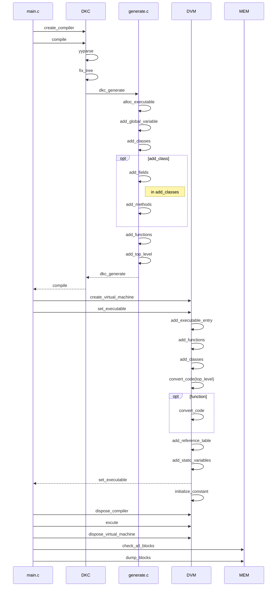
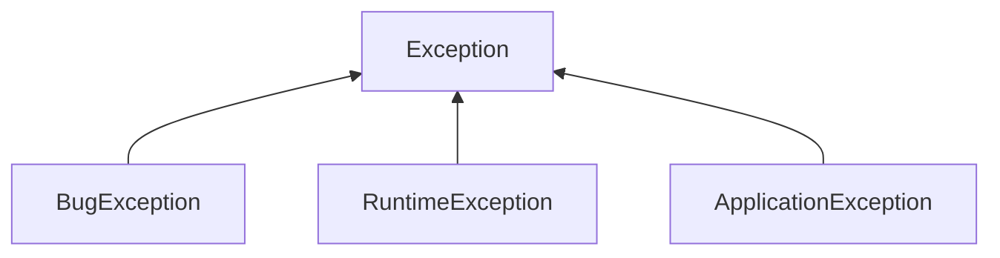

# main


---

## create.c
创建语法分析树

## fix_tree.c
修正分析树， ‘语义分析’。
1. 常量表达式的包装
2. 为表达式添加类型
3. 增加转换节点
    - 双目运算中的类型转换
    - 赋值时的类型转换
4. 函数内的变量声明
5. 标识符和声明的绑定

## generate
自上而下遍历分析树生成字节码，创建 DVM_Executable 结构体。
1. 常量池
2. 全局变量
3. 函数
4. 顶层结构的代码
5. 行号对应表
6. 栈大小（need_stack_size）

## DVM
- 栈 局部变量，函数的参数和函数返回的返回信息等
- 堆 通过引用进行访问的内存区域
- 静态（static）空间 保存全局变量

### 加载/链接 DVM_Executable 到 DVM
DVM_add_executable()
1. 将函数添加到DVM_VirtualMachine中
2. 替换函数的索引
3. 修正局部变量的索引值
4. 将全局变量添加到DVM_VirtualMachine中
### 执行
### 函数调用
1. 将参数以从前向后的顺序入栈
2. 使用push_function将函数的索引值入栈
3. 执行invoke，调用栈顶的函数
4. 将返回信息入栈
5. 设置base的值
6. 初始化局部变量
7. 替换执行中的executable和函数
8. 将程序计数器置为0并开始执行

### 异常

1. BugException 只要没有程序错误就不会发生的异常
2. RuntimeException 程序不能预期的异常
3. ApplicationException 应该被程序预期到的异常

可以被throw和catch的只有Exception的子类.

---

## 一个对象的创建和方法的调用

### 对象创建函数 dvm_create_class_object_i
1. 检查 gc (heap.c#check_gc)
2. 创建 DVM_ObjectRef 分配内存初始化属性 (heap.c#alloc_object)
3. 将 class_table 赋值给对象的 vtable
4. 添加 field 并设置默认值
4. 初始化 field, 执行 field_initializer 字节码

### 方法的调用
虚拟机用一个数组存放所有的方法和函数, 方法的调用会事先将方法所在的对象入栈, 通过对象的 vtable 找到方法所在的 index, 通过 invoke 指令调用指定 index 的方法.
而函数的调用将直接调用指令中给出的 index 对应的函数, 不需要 vtable.

方法的调用字节码
```java
Point1 p = new Point2(5, 10);
// new 1                    以指定 index(1) 的 class 创建一个 class 对象(dvm_create_class_object_i)并入栈
// push_int_1byte 5         将对象构造函数的参数入栈
// push_int_1byte 10        参数入栈
// duplicate_offset 2       栈中偏移量为2的元素即刚刚创建的 class 对象复制一份并入栈
p.print();
// push_method 1            取栈顶的对象, 以 table index(1) 从对象的 vtable 中取出 method 的 index 并入栈
// invoke                   调用以栈顶元素为 index 的方法
// ...
```


函数的调用字节码
```java
void foo() {
    println("hello world\n");
}

foo();
// push_function 5          将函数的 index 入栈(index 5 对应函数 foo)
// invoke                   调用以栈顶元素为 index 的函数
// ...
```