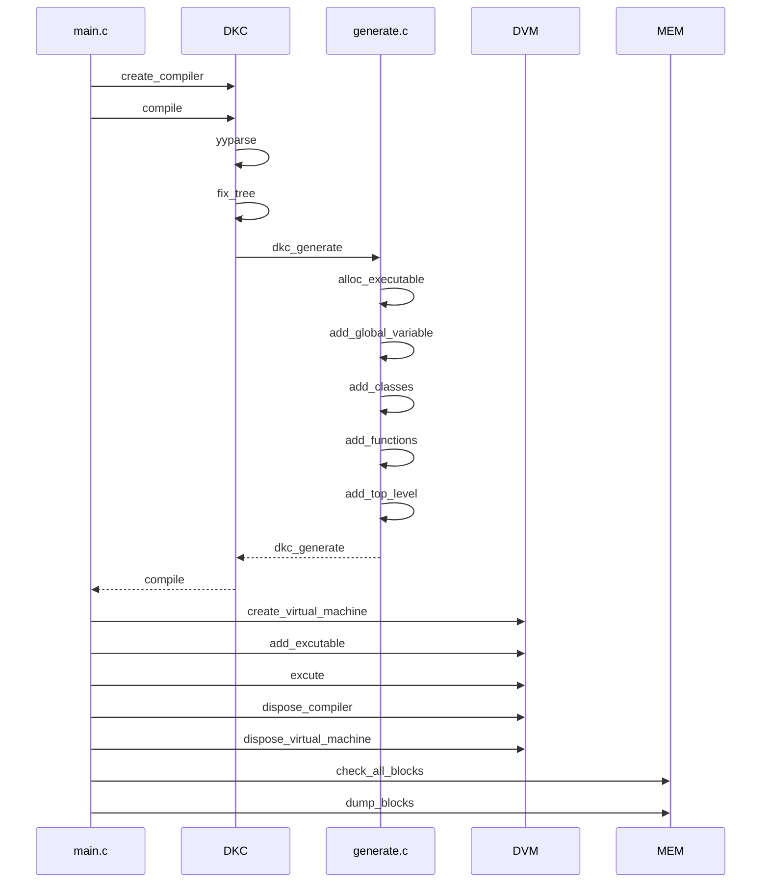
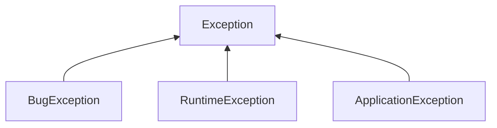

# main

---

## fix_tree
1. 常量表达式的包装
2. 为表达式添加类型
3. 增加转换节点
    - 双目运算中的类型转换
    - 赋值时的类型转换
4. 函数内的变量声明
5. 标识符和声明的绑定

## generate
创建 DVM_Executable 结构体
1. 常量池
2. 全局变量
3. 函数
4. 顶层结构的代码
5. 行号对应表
6. 栈大小（need_stack_size）

## DVM
- 栈 局部变量，函数的参数和函数返回的返回信息等
- 堆 通过引用进行访问的内存区域
- 静态（static）空间 保存全局变量

### 加载/链接 DVM_Executable 到 DVM
DVM_add_executable()
1. 将函数添加到DVM_VirtualMachine中
2. 替换函数的索引
3. 修正局部变量的索引值
4. 将全局变量添加到DVM_VirtualMachine中
### 执行
### 函数调用
1. 将参数以从前向后的顺序入栈
2. 使用push_function将函数的索引值入栈
3. 执行invoke，调用栈顶的函数
4. 将返回信息入栈
5. 设置base的值
6. 初始化局部变量
7. 替换执行中的executable和函数
8. 将程序计数器置为0并开始执行

### 异常

1. BugException 只要没有程序错误就不会发生的异常
2. RuntimeException 程序不能预期的异常
3. ApplicationException 应该被程序预期到的异常