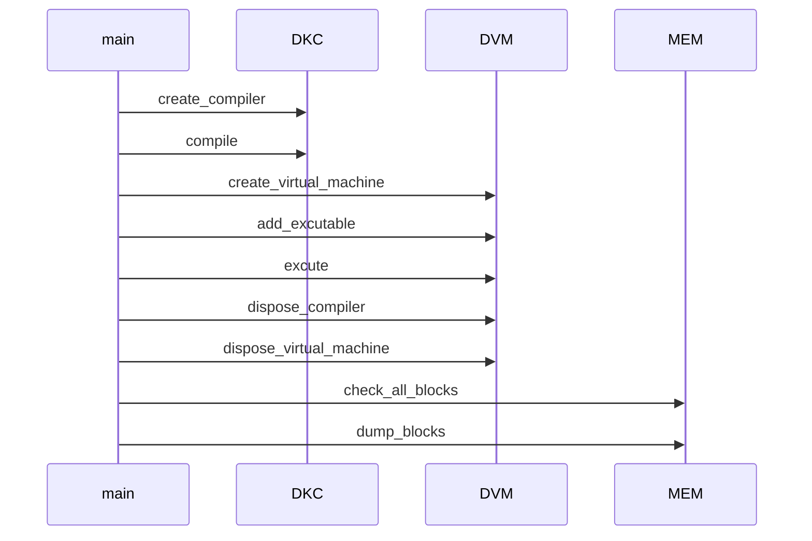

# main

```mermaid
sequenceDiagram
    main->>DKC: create_compiler
    main->>DKC: compile
    main->>DVM: create_virtual_machine
    main->>DVM: add_excutable
    main->>DVM: excute
    main->>DVM: dispose_compiler
    main->>DVM: dispose_virtual_machine
    main->>MEM: check_all_blocks
    main->>MEM: dump_blocks
```