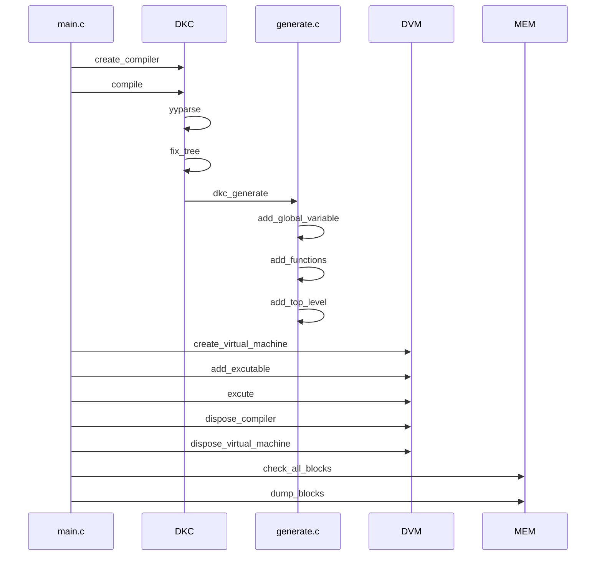

# main

```mermaid
sequenceDiagram
    main.c->>DKC: create_compiler
    main.c->>DKC: compile
    DKC->>DKC: yyparse
    DKC->>DKC: fix_tree
    DKC->>generate.c: dkc_generate
    generate.c->>generate.c: add_global_variable
    generate.c->>generate.c: add_functions
    generate.c->>generate.c: add_top_level
    main.c->>DVM: create_virtual_machine
    main.c->>DVM: add_excutable
    main.c->>DVM: excute
    main.c->>DVM: dispose_compiler
    main.c->>DVM: dispose_virtual_machine
    main.c->>MEM: check_all_blocks
    main.c->>MEM: dump_blocks
```